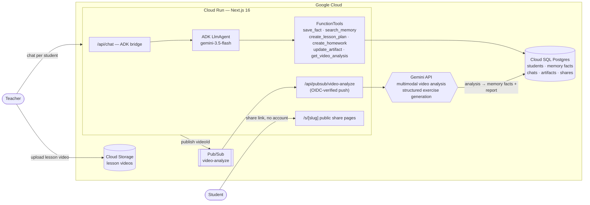

# TeachFlow — Your AI Teaching Studio

**Google AI Agents Challenge submission · Track 1: Build (Net-New Agents)**

TeachFlow is a per-student AI copilot for teachers. Every student gets a
persistent agent chat with long-term **agentic memory**: the agent remembers
strengths, recurring errors, interests and progress, and uses them to draft
**lesson plans** and **interactive homework** on a live canvas next to the
chat. Teachers upload lesson recordings; a Gemini multimodal pipeline analyzes
the video and feeds insights straight into the student's memory — so the next
chat already knows what happened in yesterday's lesson. Any artifact can be
shared with one click: students open a public link and do their homework with
instant feedback, no account needed.

## How it works



1. **Per-student agent (Google ADK + Gemini).** Each request builds an ADK
   `LlmAgent` whose instruction embeds the student's profile and memory facts.
   The agent decides what is durable (`save_fact`) — that decision-making is
   what makes the memory *agentic* rather than transcript-stuffing. ADK events
   are bridged into an AI SDK UI message stream for token-level streaming UX.
2. **Artifacts on a canvas.** The agent creates lesson plans (markdown) and
   homework (structured JSON validated against per-exercise Zod schemas,
   generated with Gemini structured output) that stream live into the
   right-hand canvas while the chat continues on the left.
3. **Video pipeline.** Upload → Cloud Storage → Pub/Sub → push back into the
   service → Gemini analyzes the actual video against a teaching rubric →
   written up as an artifact + distilled into memory facts.
4. **Student share links.** `/s/[slug]` pages are public; homework renders as
   an interactive quiz player (multiple choice, fill-the-blank, word matching,
   gap fill, word puzzles, sentence matching) with instant feedback.

## Stack

- **Agent:** Google **ADK for TypeScript** (`@google/adk`) + **Gemini 3.5 Flash**
- **App:** Next.js 16 (App Router, React 19), Vercel AI SDK UI streaming,
  Tailwind v4 + shadcn/ui — based on the vercel/ai-chatbot template
- **Google Cloud:** Cloud Run (single service), Cloud SQL (Postgres 16),
  Cloud Storage, Pub/Sub (OIDC-authenticated push), Gemini API
- **DB:** Drizzle ORM

## Run locally

```bash
pnpm install
cp .env.example .env.local   # set POSTGRES_URL + GOOGLE_GENERATIVE_AI_API_KEY (+ GOOGLE_API_KEY)
pnpm db:push
pnpm dev
```

Local mode needs **no GCP resources**: uploads land on disk and video analysis
runs in-process (`PUBSUB_MODE=direct`). Visit `/`, sign in (or continue as
guest), add a student, and ask the agent to plan a lesson.

## Deploy

```bash
POSTGRES_URL_PROD=... GEMINI_API_KEY=... AUTH_SECRET_PROD=... ./infra/deploy.sh
```

Creates/updates the Cloud Run service, wires the Cloud SQL socket, and creates
the OIDC-authenticated Pub/Sub push subscription for video analysis.

## Demo flow

1. Add a student (level, languages, goals).
2. Chat: "Maria struggled with past simple again today" → agent saves a memory fact.
3. "Plan our next 60-minute lesson" → lesson plan streams onto the canvas.
4. "Now make homework from it" → interactive homework streams in, exercise by exercise.
5. Share → open `/s/…` in incognito → play the quiz with instant feedback.
6. Upload a lesson recording → analysis lands as an artifact + new memory facts.
7. New chat: "What did we cover last lesson?" → the agent answers from memory.
