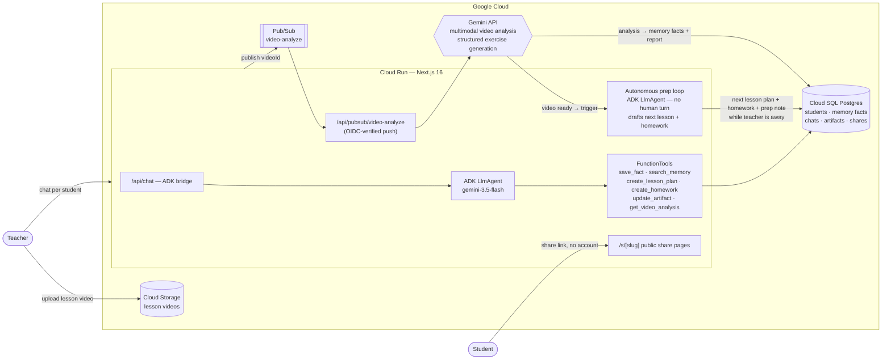

# TeachFlow — Your AI Teaching Studio

**Google AI Agents Challenge submission · Track 1: Build (Net-New Agents)**

Independent language tutors spend **~45 minutes per student** preparing each
lesson — reviewing what happened last time, planning the next session, and
writing homework by hand. TeachFlow **cuts that to under 5 minutes**: a
per-student agent with long-term memory drafts the next lesson plan and
interactive homework on demand, and **turns a 1-hour lesson recording into a
next-lesson plan + homework with zero teacher time** — drafted autonomously
while the teacher is away. See the [Business case](#business-case) for market
sizing, unit economics, and pricing.

---

TeachFlow is a per-student AI copilot for teachers. Every student gets a
persistent agent chat with long-term **agentic memory**: the agent remembers
strengths, recurring errors, interests and progress, and uses them to draft
**lesson plans** and **interactive homework** on a live canvas next to the
chat. Teachers upload lesson recordings; a Gemini multimodal pipeline analyzes
the video and feeds insights straight into the student's memory — so the next
chat already knows what happened in yesterday's lesson. Any artifact can be
shared with one click: students open a public link and do their homework with
instant feedback, no account needed.

## How it works



The two edges `GEM → PREP` and `PREP → SQL` are the SalesShortcut-style
autonomous loop: as soon as a lesson video is analyzed, a second ADK agent runs
**with no human turn** — it reads the analysis, drafts the next-lesson plan and a
homework set targeting the student's struggles, and records a "Proactive prep
ready" memory note, all persisted before the teacher reopens the app.

1. **Per-student agent (Google ADK + Gemini).** Each request builds an ADK
   `LlmAgent` whose instruction embeds the student's profile and memory facts.
   The agent decides what is durable (`save_fact`) — that decision-making is
   what makes the memory *agentic* rather than transcript-stuffing. ADK events
   are bridged into an AI SDK UI message stream for token-level streaming UX.
2. **Artifacts on a canvas.** The agent creates lesson plans (markdown) and
   homework (structured JSON validated against per-exercise Zod schemas,
   generated with Gemini structured output) that stream live into the
   right-hand canvas while the chat continues on the left.
3. **Video pipeline.** Upload → Cloud Storage → Pub/Sub → push back into the
   service → Gemini analyzes the actual video against a teaching rubric →
   written up as an artifact + distilled into memory facts.
4. **Student share links.** `/s/[slug]` pages are public; homework renders as
   an interactive quiz player (multiple choice, fill-the-blank, word matching,
   gap fill, word puzzles, sentence matching) with instant feedback.
5. **Closed learning loop.** When a student finishes shared homework, results
   flow straight back into per-student memory: a `progress` fact
   ("Homework '<title>': scored X/Y") plus one `error` fact per failed exercise,
   written with `sourceRef` set to the share slug — so the next time the teacher
   asks "How did Maria do?", the agent answers from authoritative evidence of
   how the student actually performed.

## Business case

**Lead metric.** TeachFlow cuts per-student lesson prep from **~45 minutes to
under 5 minutes**, and **turns a 1-hour lesson recording into a next-lesson
plan + homework with zero teacher time** — the agent drafts both autonomously
after a recording is analyzed, before the teacher even opens the app. For a
tutor with 15 active students teaching weekly, that is **~10 hours/week of prep
returned** — time that converts directly into more billable lessons.

### Market

- **Global private tutoring ≈ $100B+**, growing ~9% CAGR — large and highly
  fragmented across millions of independent providers.
- **Online language learning ≈ $60B** and expanding as tutoring moves to
  video-first delivery (Preply, iTalki, Cambly, Lingoda).
- **Tens of millions of independent tutors and teachers worldwide**; language
  tutors are the sharpest wedge because lessons are recurring, recorded, and
  homework-heavy.
- **ICP:** independent language tutors and small tutoring studios (1–20
  teachers) who run recurring 1:1 or small-group lessons and assign homework.

### Unit economics

Per-action Gemini costs estimated from public Gemini pricing for the actions in
our stack (gemini-3.5-flash for chat/generation, multimodal for video, Gemini
TTS + image gen for exercises). **All figures below are estimates** for typical
usage.

| Action | Est. Gemini cost |
|---|---|
| Chat turn (agent reply) | < $0.005 (fractions of a cent) |
| Homework generation (structured) | ~$0.01–0.03 |
| Lesson-plan generation | ~$0.01–0.02 |
| Video analysis (30-min lesson) | ~$0.10–0.30 |
| TTS listening clip | a few cents |
| Image flashcard | a few cents |

**Estimated monthly cost per active student** (one lesson/week → ~4 chat-heavy
sessions, a few homework/lesson-plan generations, occasional video analysis and
media exercises): **~$1–2/student/month** on Studio (with video), **well under
$1** on Solo (no video analysis).

| Plan | Price | Students | Est. monthly Gemini cost | Est. gross margin |
|---|---|---|---|---|
| **Solo** | $19/mo | up to 15 | ~$3–6 (no video) | **~85–90%** |
| **Studio** | $49/mo | unlimited (typ. 30–40) | ~$5–10 | **~85–90%** |

At typical roster sizes both tiers land at **~85–90% gross margin** — the heavy
work (video analysis) is the rarest action, and chat/homework generation are
fractions of a cent each.

### Pricing

- **Solo — $19/mo:** up to 15 students, per-student agent memory, lesson plans +
  interactive homework, unlimited share links.
- **Studio — $49/mo:** unlimited students, **video lesson analysis** with
  automatic memory from recordings, priority generation.

### Go-to-market

- **Tutor communities** (Facebook/Reddit groups, Discords, tutor newsletters) —
  the prep-time metric is the hook.
- **Marketplace teachers on Preply / iTalki / Cambly** — they already record
  lessons and assign homework; TeachFlow plugs straight into that workflow.
- **Small studio pilots** — onboard a 3–8 teacher studio, prove prep-time
  savings, expand seat by seat.

### Roadmap

- **Parent reports** — auto-generated progress summaries per student.
- **Homework results analytics** — dashboards over the results that already
  flow back into agent memory (engagement + outcomes).
- **Multi-teacher studios** — shared student rosters, roles, studio billing.
- **Google Cloud Marketplace listing** — distribution to GCP-billed orgs
  (Track 3 trajectory).

## Evals

Homework generation is measured against a 10-case golden set (CEFR A1–C1, 8
languages) on three axes — schema validity, deterministic structural checks, and
an LLM-as-judge pedagogy rubric. On the latest real run (`gemini-3.5-flash`):

- **100% schema validity** (10/10 sets parse against `homeworkSchema`)
- **100% structural pass rate** (every set: ≥4 exercises, ≥3 distinct types,
  valid correct-answer indices, media URLs present)
- **4.47/5 mean pedagogy-judge score** (level-appropriateness 4.40,
  topic-relevance 4.80, instruction-clarity 4.20)

Reproduce: `npx tsx --require ./scripts/_no-server-only.cjs evals/homework-eval.ts` ·
full methodology, rubric, dataset, and per-brief numbers in
[`docs/EVALS.md`](docs/EVALS.md).

## Production readiness

Guardrails that exist in the codebase today (not aspirational):

- **Output validation:** every homework artifact is generated against a
  `zod`/`responseJsonSchema` contract (`lib/quiz/homework-schema.ts`) and parsed
  before it reaches the canvas — malformed model output never renders.
- **Pedagogy-critic sub-agent:** a second `gemini-3.5-flash` ADK `LlmAgent`
  (`pedagogy_reviewer`, exposed as an AgentTool) reviews every generated homework
  set against an embedded pedagogy rubric and returns a structured
  `{score, issues, suggestions}` critique — a visible generator→critic loop,
  surfaced in chat.
- **Per-student tool scoping (tool permissioning):** every agent tool closes
  over a single `studentId`; the agent is structurally incapable of reading or
  writing another student's data — cross-student access is impossible by
  construction, not by check.
- **Token / cost guard:** the agent runner caps each run at a generous
  output-char / event ceiling (`TOKEN_GUARD_CHARS`, default 200k chars / 500
  events); past it the loop aborts gracefully, streams a notice, and logs
  `cost_guard_triggered`.
- **Structured tool-call logging with run IDs:** each agent run gets a
  `crypto.randomUUID()` `runId`; one single-line JSON record (`run_start` /
  `tool_call` / `tool_result` with latency ms / `run_end` with total ms + event
  count) goes to stdout, ingested by Cloud Logging as queryable `jsonPayload`
  (e.g. `jsonPayload.tool="create_homework"`, `jsonPayload.runId="…"`).
- **OIDC-verified Pub/Sub:** the video-analysis push endpoint verifies
  OIDC-signed Pub/Sub requests; the unauthenticated surface is limited to
  `/s/[slug]` share links.
- **MCP fallback:** the exercise catalog is served over a real stdio MCP server
  with an in-process `FunctionTool` fallback, so the capability degrades
  gracefully if the MCP child process is unavailable.
- **Kill-switches:** env flags gate optional subsystems (`USE_ADK`,
  `MCP_ENABLED`, `PROACTIVE_PREP`, `PUBSUB_MODE`) so any path can be disabled
  without code changes.

## Stack

- **Agent:** Google **ADK for TypeScript** (`@google/adk`) + **Gemini 3.5 Flash**
- **App:** Next.js 16 (App Router, React 19), Vercel AI SDK UI streaming,
  Tailwind v4 + shadcn/ui — based on the vercel/ai-chatbot template
- **Google Cloud:** Cloud Run (single service), Cloud SQL (Postgres 16),
  Cloud Storage, Pub/Sub (OIDC-authenticated push), Gemini API
- **DB:** Drizzle ORM

## Run locally

```bash
pnpm install
cp .env.example .env.local   # set POSTGRES_URL + GOOGLE_GENERATIVE_AI_API_KEY (+ GOOGLE_API_KEY)
pnpm db:push
pnpm dev
```

Local mode needs **no GCP resources**: uploads land on disk and video analysis
runs in-process (`PUBSUB_MODE=direct`). Visit `/`, sign in (or continue as
guest), add a student, and ask the agent to plan a lesson.

## Deploy

```bash
POSTGRES_URL_PROD=... GEMINI_API_KEY=... AUTH_SECRET_PROD=... ./infra/deploy.sh
```

Creates/updates the Cloud Run service, wires the Cloud SQL socket, and creates
the OIDC-authenticated Pub/Sub push subscription for video analysis.

## Demo flow

1. Add a student (level, languages, goals).
2. Chat: "Maria struggled with past simple again today" → agent saves a memory fact.
3. "Plan our next 60-minute lesson" → lesson plan streams onto the canvas.
4. "Now make homework from it" → interactive homework streams in, exercise by exercise.
5. Share → open `/s/…` in incognito → play the quiz with instant feedback.
6. Upload a lesson recording → analysis lands as an artifact + new memory facts.
7. New chat: "What did we cover last lesson?" → the agent answers from memory.
